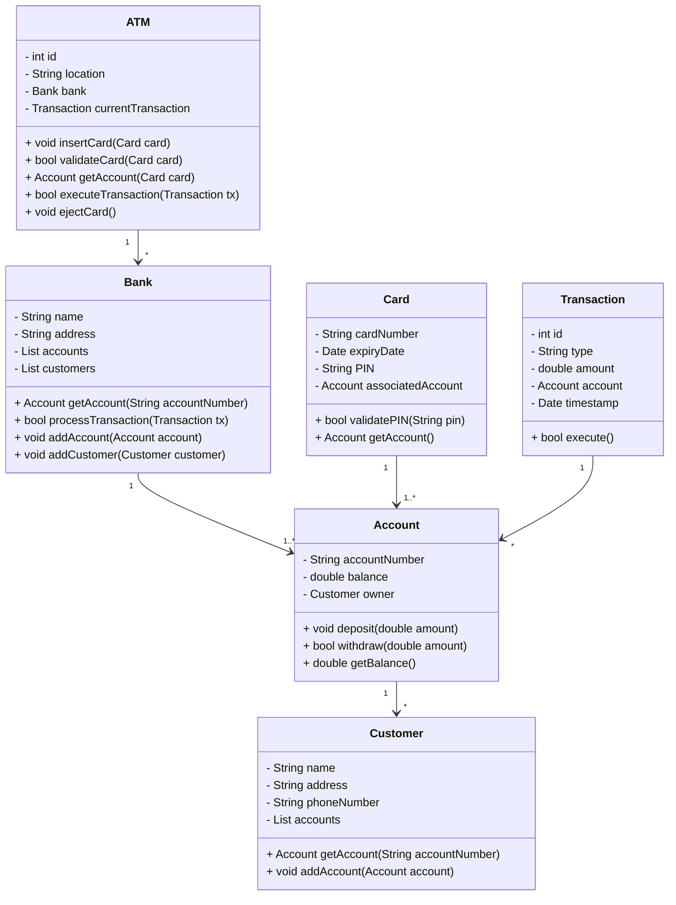

```mermaid

classDiagram
    class ATM {
        - int id
        - String location
        - Bank bank
        - Transaction currentTransaction
        + void insertCard(Card card)
        + bool validateCard(Card card)
        + Account getAccount(Card card)
        + bool executeTransaction(Transaction tx)
        + void ejectCard()
    }

    class Bank {
        - String name
        - String address
        - List<Account> accounts
        - List<Customer> customers
        + Account getAccount(String accountNumber)
        + bool processTransaction(Transaction tx)
        + void addAccount(Account account)
        + void addCustomer(Customer customer)
    }

    class Account {
        - String accountNumber
        - double balance
        - Customer owner
        + void deposit(double amount)
        + bool withdraw(double amount)
        + double getBalance()
    }

    class Transaction {
        - int id
        - String type
        - double amount
        - Account account
        - Date timestamp
        + bool execute()
    }

    class Customer {
        - String name
        - String address
        - String phoneNumber
        - List<Account> accounts
        + Account getAccount(String accountNumber)
        + void addAccount(Account account)
    }

    class Card {
        - String cardNumber
        - Date expiryDate
        - String PIN
        - Account associatedAccount
        + bool validatePIN(String pin)
        + Account getAccount()
    }

    ATM "1" --> "*" Bank
    Bank "1" --> "1..*" Account
    Account "1" --> "*" Customer
    Card "1" --> "1..*" Account
    Transaction "1" --> "*" Account


```